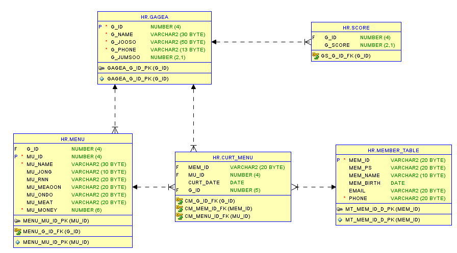
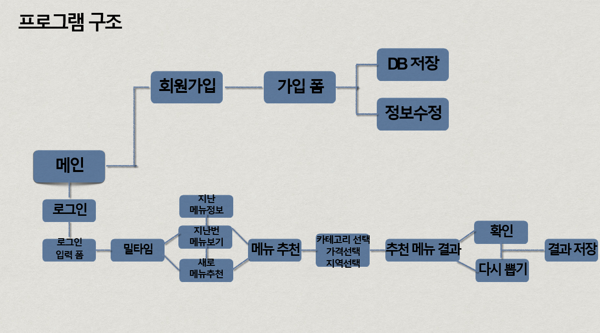

## :pushpin: mealtime
>음식 메뉴 추천 프로그램 


</br>

### 1.제작기간&참여 인원
* 2022.9.13 ~ 2022.9.19(4명)   
* 팀프로젝트

</br>

### 2.사용기술
* JAVA11   
* ORACLE

</br>

### 3.ERD


</br>

### 4.핵심기능
이 프로그램의 핵심기능은 음식 메뉴 추천입니다.    
사용자는 회원가입 후 로그인을 해서 음식종류, 오늘 먹고 싶지 않은 음식류, 가격대, 지역 선택 후          
랜덤으로 음식을 추천받을 수 있습니다.          
그리고 조회된 음식점을 이용 후에 평점을 매길 수 있습니다.         
   
<details>
<summary>핵심기능설명펼치기</summary>   
   
#### 4-1. 전체흐름     
   
</br>     
   

   
#### 4-2. 사용자 입력   
* 로그인 기능 📍[코드확인](https://github.com/Seoha95/mealtime/blob/e3e765cb8c96f54f6764d4a201913b1f79a55402/src/mealtime/Login.java#L68-L96)   
   * 사용자 인증 : 로그인 페이지를 통해 사용자의 아이디와 비밀번호를 입력받아 인증합니다.       
   * 안내문구 표시 : 필수 필드가 비어있을 경우, 사용자에게 안내문구를 표시하여 필수 정보를 입력하도록 유도합니다.      
* 회원가입 📍[코드확인](https://github.com/Seoha95/mealtime/blob/b9a16feb89ff182b8a57e24e79e506467e1106a4/src/mealtime/SignUp.java#L127-L158)    
   * 사용자 등록 : 회원가입 페이지를 통해 사용자의 기본 정보(아이디, 비밀번호, 비밀번호확인, 생일, 이름, 이메일, 핸드폰번호)를     
     입력받아 회원으로 등록합니다.       
   * 일치 시 회원가입 : 비밀번호와 재확인 비밀번호가 일치하는 경우, 회원가입을 진행합니다.     
   
#### 4-3. 사용자 선택
 * 음식종류 선택 📍[코드확인](https://github.com/Seoha95/mealtime/blob/b9a16feb89ff182b8a57e24e79e506467e1106a4/src/mealtime/MenuRecommend.java#L62-L115)   
    * 음식 종류 선택 : 사용자는 음식 종류 선택 화면에서 원하는 종류를 선택할 수 있습니다. 
    * 선택 옵션 : 한식, 중식, 양식, 일식과 같은 음식 종류가 사용자에게 제공됩니다.        
 * 오늘 먹고 싶지 않은 음식류 선택 📍[코드확인](https://github.com/Seoha95/mealtime/blob/b9a16feb89ff182b8a57e24e79e506467e1106a4/src/mealtime/NotPreferred.java#L106-L137)
    * 음식 종류 선택 : 사용자는 오늘 먹고 싶지 않은 음식류를 선택할 수 있습니다.    
    * 선택 옵션 : 면과 밥, 매운음식과 안 매운 음식, 차가운 음식과 뜨거운 음식과 같은 음식류가 사용자에게 제공됩니다.      
 * 가격대 선택 📍[코드확인](https://github.com/Seoha95/mealtime/blob/b9a16feb89ff182b8a57e24e79e506467e1106a4/src/mealtime/Price.java#L79-L98)   
    * 가격대 선택 : 사용자가 화면의 가격대를 선택할 수 있습니다.    
    * 선택 옵션 : 가격대 별로 구분된 옵션이 사용자에게 제공됩니다.        
 * 지역 선택 📍[코드확인](https://github.com/Seoha95/mealtime/blob/b9a16feb89ff182b8a57e24e79e506467e1106a4/src/mealtime/Location.java#L46-L63)   
    * 지역 선택 : 사용자가 화면에서 원하는 지역을 선택할 수 있습니다.   
    * 선택 옵션 : 다양한 지역 옵션이 사용자에게 제공됩니다.      
 * 사용자가 평점체크 📍[코드확인](https://github.com/Seoha95/mealtime/blob/b9a16feb89ff182b8a57e24e79e506467e1106a4/src/mealtime/Grade.java#L107-L141) 
    * 평점 매기기 : 사용자는 추천 음식점을 이용한 후, 해당 음식점에 대한 평점을 매길 수 있습니다.   
    * 평점 활용 : 사용자가 매긴 평점은 다른 사용자에게 추천 음식점을 보여줄 때 평점을 함께 표시하여 보여줄 수 있습니다.     
      
#### 4-4. 랜덤 음식 추천
 * 사용자가 선택사항 체크 후 랜덤 음식 추천 📍[코드확인](https://github.com/Seoha95/mealtime/blob/b9a16feb89ff182b8a57e24e79e506467e1106a4/src/mealtime/TodayMenu.java#L55-L74)
    * 사용자가 선택한 조건 안에서 랜덤으로 메뉴 추천을 해줍니다.     
</details>   

</br>

### 5.핵심 트러블 슈팅   
   
#### 5-1 이전에 먹은 음식 데이터를 띄우는 방식의 문제   
이전에 먹은 음식 데이터를 띄울 때 일반적으로 많이 사용하는 JTable을 사용해서 표형태로 만드는 것이 아닌      
틀 없이 데이터를 띄우는 방식에 대한 고민을 통해 JLabel 안에 데이터를 띄우는 방식으로 코드를 수정했습니다.      

<details>   
<summary>기존코드</summary>  
      
```
String header[] = {"날짜", "가게이름", "메뉴이름"} 
String data[][] = {
                  {"2022-05-28", "순대집", "순대볶음"}
                  {"2022-03-28", "막창집", "막창"}
                  }
                   JTable table = new JTable(data, header);
```   
</details>    

<details>   
<summary>개선된 코드</summary>  
      
```
JLabel Label1 = new JLabel(curL.get(0).getCurt_date()+"    "+curL.get(0).getG_name()+"    "+curL.get(0).getMu_name());
Label1.setBounds(63, 97, 319, 27);
contentPane.add(Label1);
```   
</details>       
   
### 6. 느낀점   
    
처음하는 프로젝트라서 팀원들과 어떤 것부터 맡아서 진행해야 하는지 어려웠던 것 같습니다.   
그리고 팀원과 코드를 같이 공유하면서 작업을 진행해서 좋았던 점은 더 나은 코드가 있으면 서로 제안을 하고       
반영이 되어 더 좋은 프로그램을 만들 수 있었다는 점입니다.   
   

